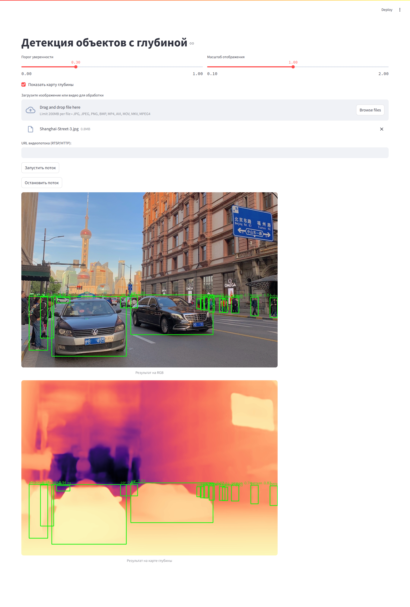

# 🚗 Обнаружение объектов с использованием карт глубины

Веб-приложение для детекции объектов (транспортных средств и пешеходов) на изображениях, видео и видеопотоках с использованием нейросети YOLOv5 и предсказанных карт глубины от ZoeDepth.

---

## 📌 О проекте

Данный проект демонстрирует, как предсказанные карты глубины могут быть интегрированы в пайплайн детекции объектов для повышения точности, особенно в задачах автономного вождения и анализа уличной сцены.

Приложение построено с использованием:

- [YOLOv5](https://github.com/ultralytics/yolov5) — для детекции объектов
- [ZoeDepth](https://github.com/isl-org/ZoeDepth) — для оценки глубины сцены
- [Streamlit](https://streamlit.io) — для создания удобного веб-интерфейса
- [Docker](https://docs.docker.com) — для универсального развёртывания

---

## 🖼 Возможности

- Загрузка **изображений**, **видеофайлов** или **видеопотоков по URL**
- Выбор между режимами **RGB** и **RGB + Depth**
- Регулируемый порог уверенности (`confidence threshold`)
- Масштабирование отображаемого результата
- Работа в режиме реального времени с видеопотоком
- Поддержка запуска из Docker-контейнера

---

## 🚀 Быстрый старт

### 📦 Установка зависимостей (если без Docker)

```bash
pip install -r requirements.txt
```
### ▶️ Запуск

```bash
streamlit run streamlit_app.py
```

### 🐳 Запуск через Docker

1. Склонируйте репозиторий:

```bash
git clone https://github.com/ly4aznik/StreamlitAppWithYOLOAndDepthZoe.git
cd StreamlitAppWithYOLOAndDepthZoe
```

2. Соберите образ:

```bash
docker build -t depth-yolo-app .
```

3. Запустите контейнер:

```bash
docker run -p 8501:8501 depth-yolo-app
```

После запуска интерфейс будет доступен по адресу:
👉 [http://localhost:8501](http://localhost:8501)

---

## 📂 Структура проекта

```bash
├── streamlit_app.py          # Основной файл интерфейса
├── depth_yolo/               # Класс обработки YOLO + Depth
├── requirements.txt          # Зависимости
├── Dockerfile                # Конфигурация Docker
├── assets/                   # Примеры изображений (опционально)
└── README.md                 # Описание проекта
```

---

## 📈 Примеры интерфейса



---

## 📘 Лицензия

Проект распространяется под лицензией MIT. Свободен для использования в учебных и исследовательских целях.

---

## 👨‍💻 Автор

**Ткаченко Никита**

Дипломная работа, 2025

Южный федеральный университет, г. Ростов-на-Дону


